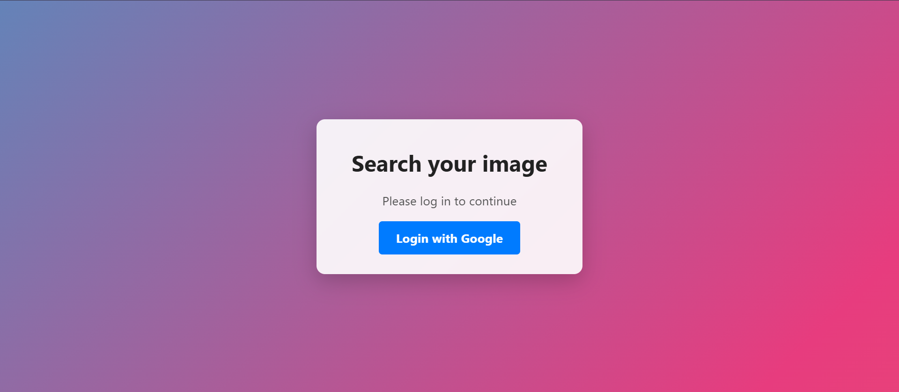
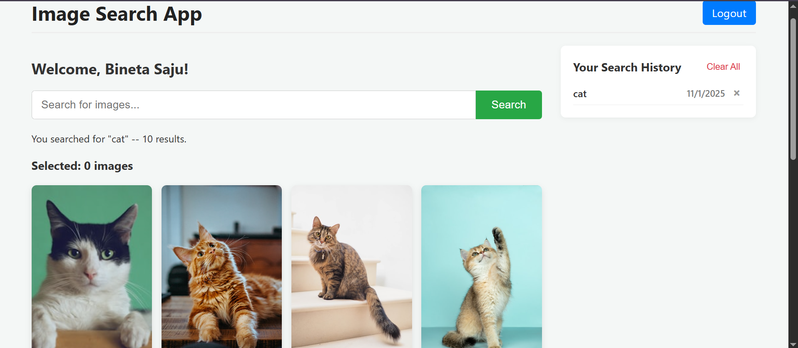
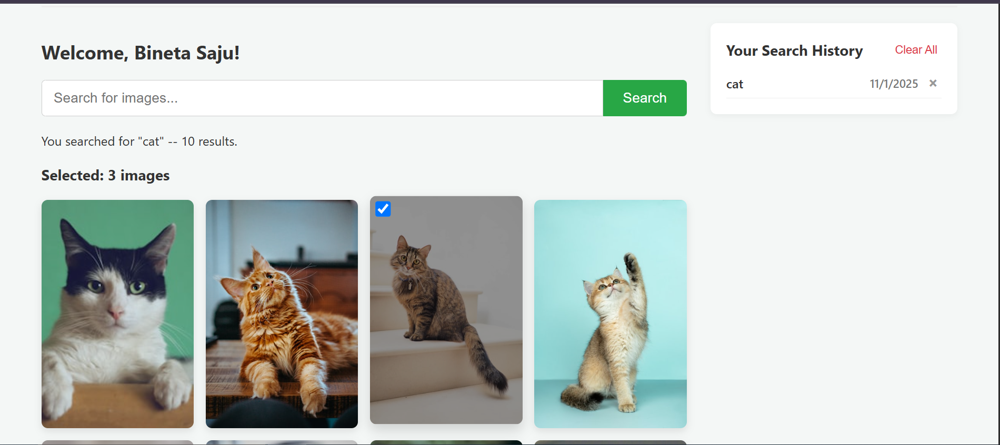
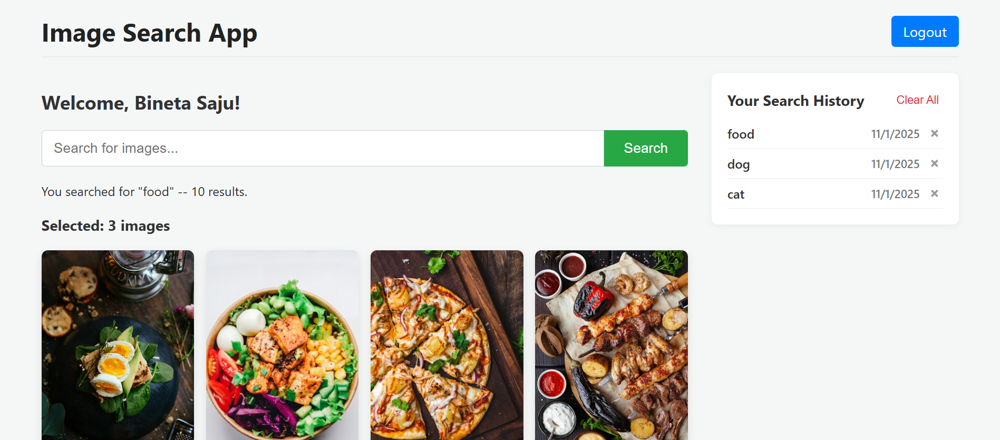

# MERN + OAuth Image Search App

This is a full-stack MERN (MongoDB, Express.js, React.js, Node.js) application built for an internship task. It's a secure image search app that uses the Unsplash API and requires users to be authenticated via Google OAuth to search, view history, and see top searches.

---

## ✨ Features

* **Secure Google OAuth:** Users must log in with their Google account. The app is split into a public login page and a private search dashboard.
* **Animated Login Page:** A clean, centered login screen with a self-moving, animated gradient background.
* **Image Search:** Authenticated users can search for images, which are fetched from the Unsplash API.
* **4-Column Grid:** Results are displayed in a responsive 4-column grid.
* **Multi-Select:** Users can click images to select them, and a counter tracks the total.
* **Top Searches Banner:** A banner at the top shows the top 5 most frequent searches across all users.
* **Search History:** A sidebar displays the user's personal search history.
* **Full History Control:** Users can delete individual history items or clear their entire search history.

---

## 📸 Visual Proof

Here are screenshots of the final application:

| Login Page | Main Search App |
| :---: | :---: |
|  |  |

| Selected Images | Search History |
| :---: | :---: |
|  |  |

*(**Note:** Screenshots are added to a `/screenshots` folder in the root of the repository.)*

---

## 🛠️ Setup and Installation

To run this project locally, you will need to:

### 1. Clone the Repository

```bash
git clone [https://github.com/binetasaju/mern-image-search.git](https://github.com/binetasaju/mern-image-search.git)
cd mern-image-search

/mern-image-search
  ├── client/         # React Frontend
  │   ├── src/
  │   │   ├── components/ # All React components
  │   │   ├── App.js      # Main router
  │   │   └── ...
  │   └── package.json
  │
  └── server/         # Express Backend
      ├── middleware/   # requireAuth.js
      ├── models/       # User.js, Search.js
      ├── routes/       # authRoutes.js, searchRoutes.js
      ├── services/     # passport.js
      ├── .env          # (Your local file with keys)
      └── server.js     # Main server file
