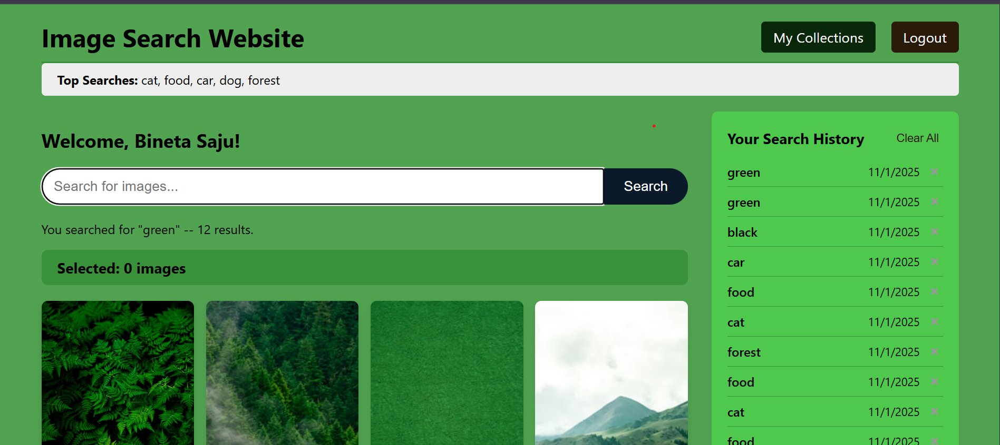
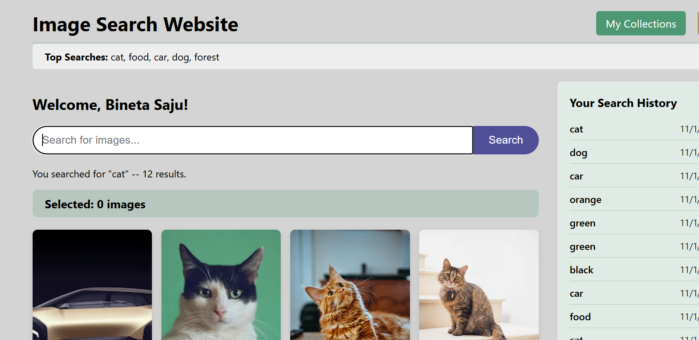
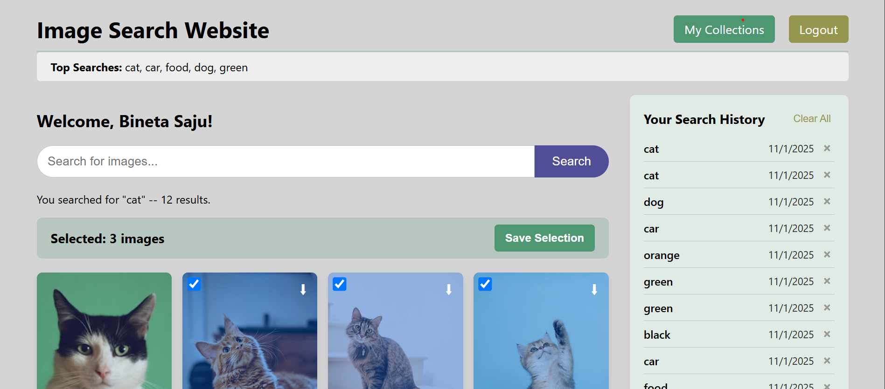
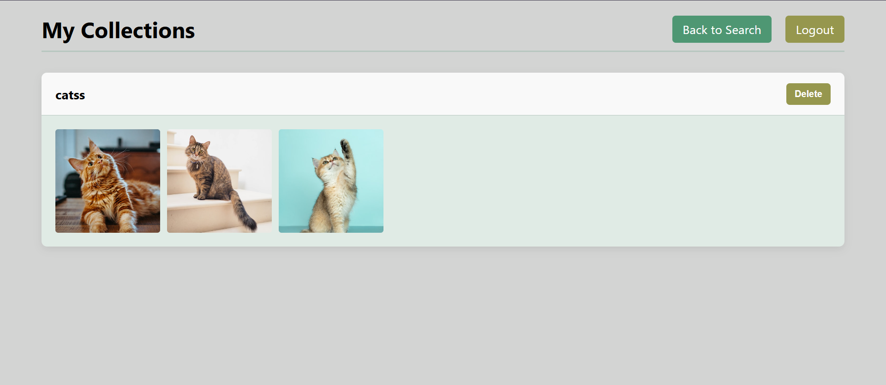

# MERN + OAuth Image Search Website

This is a full-stack MERN (MongoDB, Express.js, React.js, Node.js) application built for an internship task. It's a secure image search app that uses the Unsplash API and requires users to be authenticated via Google or GitHub to search, save, and download images.

The app's entire UI is dynamically themed based on the color palette of the user's search results.

---

## ✨ Features

* **Secure OAuth:** Login with Google or GitHub (via Passport.js).
* **Dynamic Theming:** The entire website (background, buttons, text) changes its color palette to match the user's search results.
* **Image Search & Pagination:** Fetches images from the Unsplash API with a "Load More" button.
* **Image Collections:** Users can save selected images to named collections.
* **View Collections:** A separate "My Collections" page to view and delete saved collections.
* **Search History:** A sidebar displays personal search history, with options to delete individual items or clear all.
* **Autocomplete:** The search bar suggests terms from your history and top searches.
* **Secure Image Download:** A backend-powered download feature that works with the Unsplash API.
* **Top Searches:** A banner shows the top 5 searches across all users.

---

## 📸 Visual Proof

Here are screenshots of the final application:

| Login Page | Main Search (Forest) | Main Search (Sunset) |
| :---: | :---: |:---:|
|  |  |  |

| Multi-Select | My Collections Page |
| :---: | :---: |
|  |  |

*(**Note:** Screenshots are in the `/screenshots` folder.)*

---

## 🛠️ Setup and Installation

To run this project locally:

### 1. Clone the Repository

```bash
git clone [https://github.com/binetasaju/mern-image-search.git](https://github.com/binetasaju/mern-image-search.git)
cd mern-image-search
